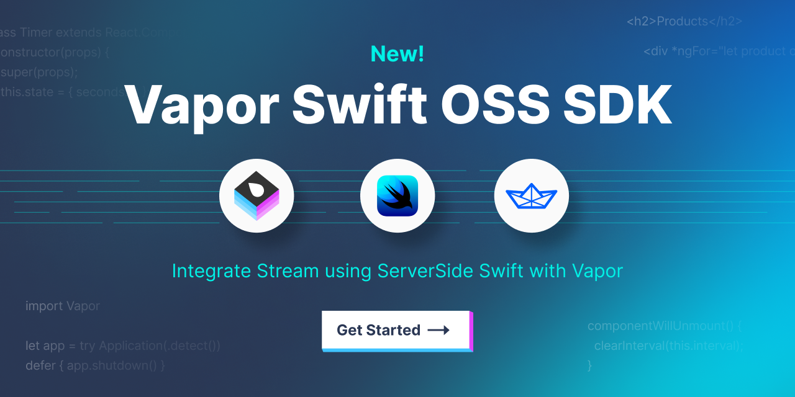

# StreamChat Vapor Swift Backend
<p align="center">
  
</p>

This library contains the code to integrate client applications with Stream's backend using [Vapor Swift](https://vapor.codes). It also contains an example application demonstrating how to integrate the library with a Vapor applications.

[](https://swiftpackageindex.com/GetStream/stream-chat-vapor-swift) [](https://swiftpackageindex.com/GetStream/stream-chat-vapor-swift)

## Integrating the libray

Add the library as a dependency to your `Package.swift`:

```swift
dependencies: [
    // ...
    .package(name: "StreamChat", url: "https://github.com/GetStream/stream-chat-vapor-swift.git", from: "0.1.0"),
],
```

Then add the the dependency to your application, e.g.:

```swift
.target(
    name: "App",
    dependencies: [
        .product(name: "StreamSDKVapor", package: "StreamChat"),
        // ...
    ],
    // ...
```

## Configuration

The Stream library requires your Stream access key and access secret to work. Configure the libray as so:

```swift
// Get the keys, for example from environment variables
guard let streamAccessKey = Environment.get("STREAM_ACCESS_KEY"), let streamAccessSecret = Environment.get("STREAM_ACCESS_SECRET") else {
    app.logger.critical("STREAM keys not set")
    fatalError("STREAM keys not set")
}

let streamConfig = StreamConfiguration(accessKey: streamAccessKey, accessSecret: streamAccessSecret)
app.stream.use(streamConfig)
```

## Generating a JWT

To generate a JWT to use with Stream's backend you need the user ID. You can then call the Stream library to generate the token:

```swift
let streamToken = try req.stream.createToken(name: userID)
```

You can pass an optional date for the token to expire at as well:

```swift
let streamToken = try req.stream.createToken(name: userID, expiresAt: Date().addingTimeInterval(3600))
```

## Running the sample application

To get started you need to do a couple things:

- Install Docker Desktop.
- Run `./scripts/localDockerDB.swift start`
- open Package.swift
- Set working dir of scheme in Xcode to root of project.
- Run project

The application allows users to register traditionally by sending a **POST** request to `/auth/register` and also using Sign In With Apple.

When registering or logging in the Vapor app returns both an API key for interacting with the API as the authenticated user and also a JWT for use with Stream's backend.

# More example code

See these supporting repositories to see how integrating this libary would look in your codebase:

- https://github.com/GetStream/stream-chat-vapor-swift-demo
- https://github.com/GetStream/stream-chat-vapor-swift-demo-ios

# Blog article
We also have a [blog article describing what is in this repository and how to get started](https://getstream.io/blog/vapor-swift-stream-server/).

